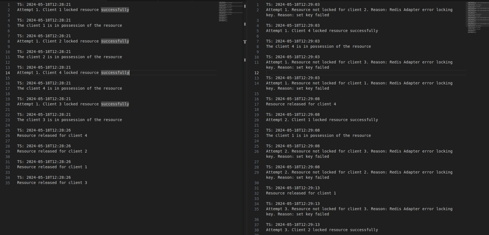
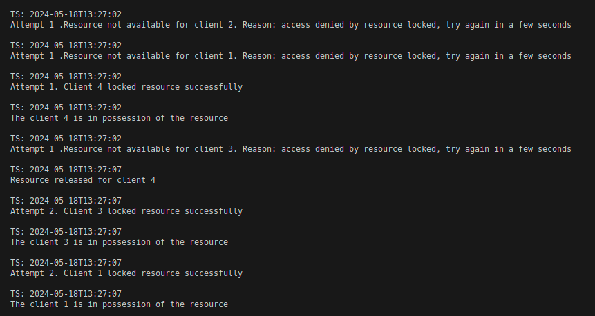
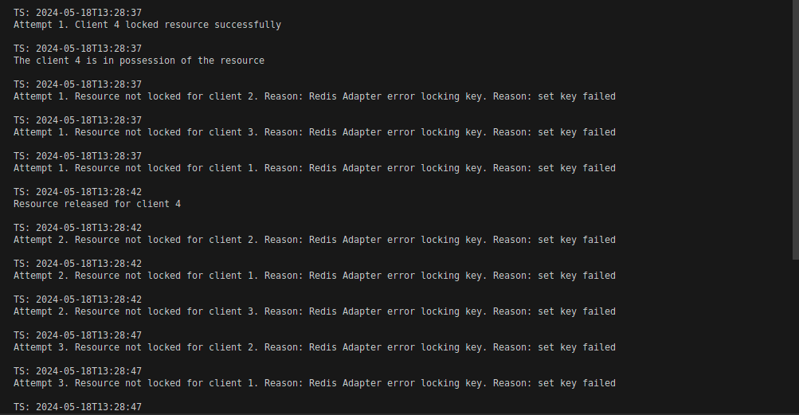

# Golang Concurrence Treat

This repo intent to teach how to properly treat minimaly a application concurrence

## The proposal

Show two ways of how to deal with concurrence in golang multithreading application. One wrong and not garantee way and one right way to do it.



## The Ways

### Wrong one

In the wrong way of dealing, I've implemented a simple golang app that check for any blocking using go-redis lib. 

### Right one

In the right way dealing, I've implemented a simple golang app that check for any blocking using ro-redis and redislock.

## Explanation

The go-redis library isn't designed for handling concurrency and resource locking effectively, unlike redislock, which is specifically built for these scenarios. Therefore, using redislock or a similar tool is preferable to relying solely on go-redis. While you might occasionally achieve your goal with go-redis, it is generally not a safe option, as it struggles with concurrency in most cases.

## Libraries

[redislock](https://pkg.go.dev/github.com/stone-stones/redislock#section-readme)

[go-redis](https://pkg.go.dev/github.com/go-redis/redis/v8#section-readme)

## Testing

Up your local Redis DB

```
docker compose up
```

### Wrong way

```
cd wrong-way/ && go run main.go
```

#### Expected output



### Right way

```
cd right-way/ && go run main.go
```

#### Expected output


